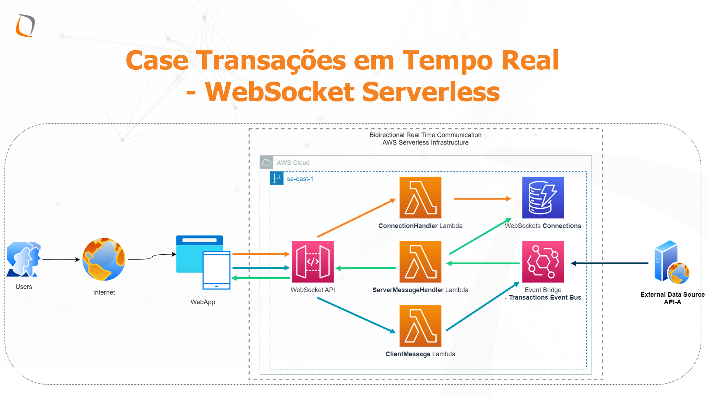

# TheDevConf - Trilha Node.js - Feitiçaria ou tecnologia: Websockets com Node.js mas sem servidores?

Este conteúdo foi adaptado do blog da AWS, [Building serverless multi-Region WebSocket APIs](https://aws.amazon.com/blogs/compute/building-serverless-multi-region-websocket-apis/), e complementado para apresentação no The Developer's Conference 2023 edição Business, na trilha [Node.JS](https://thedevconf.com/tdc/2023/business/trilha-node-js).

## Solution Overview



### Prerequisites

- An [AWS account](https://portal.aws.amazon.com/billing/signup#/start)
- Installed and authenticated [AWS CLI](https://docs.aws.amazon.com/en_pv/cli/latest/userguide/cli-chap-install.html) (authenticate with an [IAM](https://docs.aws.amazon.com/IAM/latest/UserGuide/getting-started.html) user or an [AWS STS](https://docs.aws.amazon.com/STS/latest/APIReference/Welcome.html) Security Token)
- Installed and setup [AWS Cloud Development Kit (AWS CDK)](https://docs.aws.amazon.com/cdk/latest/guide/getting_started.html)
- Installed Node.js, TypeScript and git


### Let’s get you started

#### 1. Make sure you completed the prerequisites above and cloned this repo.

```
git clone git@github.com:GuinaCosta/multi-region-websocket-api.git
```

#### 2. Open the repository in your preferred IDE and familiarize yourself with the structure of the project.

```
.
├── cdk             CDK code that defines our environment
├── img             Architecture image
└── src
    └── lambda      Handler code of the lambda function used to distribute the Lambda layer
```


#### 3. Install dependencies

node.js dependencies are declared in a `package.json`.
This project contains a `package.json` file in two different folder: 
- `cdk`: Dependencies required to deploy your stack with the CDK
- `src`: Dependencies required for the Lambda function, i.e. TypeScript types for AWS SDK 

Navigate to each of the folders and run `npm install`

#### 4. Configure your stack (optional)

Open `cdk/bin/websockets-tdc.ts` and adjust the Regions to deploy the application.

```
// List of Region codes to deploy the application to
const regionsToDeploy = ['us-west-1', 'eu-west-1', 'ap-northeast-1'];
```

#### 5. Deploy your application

Navigate to the `cdk` folder and run the following commands. 

`cdk synth` will synthesize a CloudFormation template from your CDK code. If you haven't worked with CDK in your account before, you need to [bootstrap](https://docs.aws.amazon.com/cdk/v2/guide/bootstrapping.html) the required resources for the CDK with `cdk bootstrap`, otherwise skip this step. Note that bootstrapping needs to be performed in every Region you plan to deploy to. You can then deploy the template with `cdk deploy`.


```
cdk synth 
# replace account id and Region codes
cdk bootstrap 123456789012/us-east-1 123456789012/eu-west-1 
cdk deploy --all
```

#### 6. Test the application

Connect to the Websocket API Gateway endpoints in each Region with a Websocket client or command line tool. After connecting, send a message from one of the connected clients. Your message will be send to every other client in the same Region and all clients in other Regions.

## Cleaning up

When you are done, make sure to clean everything up.

Run the following command to shut down the resources created in this workshop.

```
cdk destroy --all
```

## Security

See [CONTRIBUTING](CONTRIBUTING.md#security-issue-notifications) for more information.

## License

This library is licensed under the MIT-0 License. See the LICENSE file.
